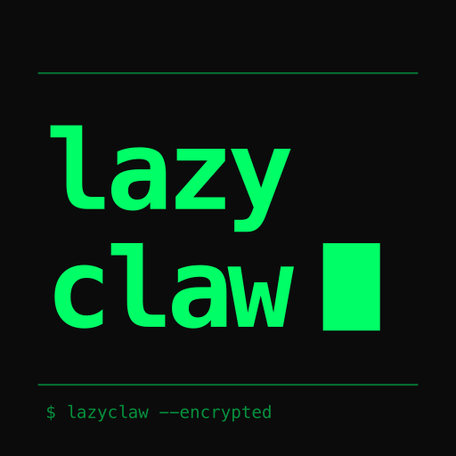

<p align="center">
  
</p>

<h1 align="center">LazyClaw</h1>

<h3 align="center">The encrypted, Python-native AI agent platform</h3>

<p align="center">
  <em>OpenClaw, but the server never sees your data.</em>
</p>

<p align="center">
  <a href="https://github.com/Bsh13lder/Lazy-Claw/blob/main/LICENSE"></a>
  <a href="https://www.python.org/"></a>
  <a href="https://github.com/Bsh13lder/Lazy-Claw/stargazers"></a>
  <a href="#contributing--feedback"></a>
  <a href="#-security--encryption"></a>
</p>

<p align="center">
  <a href="#quickstart">Quickstart</a> &bull;
  <a href="#-security--encryption">Security</a> &bull;
  <a href="#how-lazyclaw-compares">Compare</a> &bull;
  <a href="#architecture">Architecture</a> &bull;
  <a href="#features">Features</a> &bull;
  <a href="#eco-mode">ECO Mode</a> &bull;
  <a href="#parallel-agents">Parallel Agents</a> &bull;
  <a href="#browser">Browser</a> &bull;
  <a href="#mcp">MCP</a> &bull;
  <a href="#roadmap">Roadmap</a>
</p>

<!--
  ▶ HIGHEST-LEVERAGE TODO: drop a 10–15s demo GIF right here.
  Show: a Telegram/WhatsApp message → the agent takes a real action → encrypted result.
  Record with VHS (https://github.com/charmbracelet/vhs), asciinema, or Terminalizer,
  export to docs/images/demo.gif, and uncomment:
  <p align="center"></p>
  Nothing on this page converts a visitor into a star faster than a working demo.
-->

---

**LazyClaw is an open-source AI agent that encrypts every byte of your data before it touches disk.** Conversations, memories, skills, API keys, scheduled jobs — all AES-256-GCM encrypted with a key only you hold. The server stores ciphertext and cannot read your data, even if the database is stolen.

Most agent platforms store everything in plaintext. LazyClaw doesn't. It's Python-native (home to the dominant AI/ML ecosystem — PyTorch, Hugging Face, scikit-learn), MCP-native (client *and* server), runs across your messengers (Telegram, WhatsApp, Instagram, Email — text or voice), and ships a React control panel **plus** a native Flutter mobile app.

<p align="center">
  <strong>~225K LOC</strong> first-party · <strong>436 Python modules</strong> · <strong>~280 builtin skills</strong> · <strong>13 bundled MCP servers</strong> · <strong>2,450+ tests</strong> · AES-256-GCM by default
</p>

## How LazyClaw compares

The defining difference is simple: **your data is encrypted at rest, by default.** Across the self-hosted-agent space that's rare — "self-hosted" is too often treated as a synonym for "private," yet plaintext sitting on your disk is readable by anyone (or any malware) that reaches it. Security researchers routinely find tens of thousands of self-hosted AI agents exposed online with weak-or-no auth and full plaintext access. **LazyClaw encrypts every byte of your content at rest with a key only you hold.**

| | **LazyClaw** | Typical OSS agent |
|---|---|---|
| **Data at rest** | 🔐 AES-256-GCM, per-user key | 📄 plaintext files / DB |
| **API keys / secrets** | 🔐 encrypted vault, AAD-bound to owner | `.env` plaintext |
| **Account recovery** | BIP-39 12-word phrase | none / reset = data loss |
| **MCP** | native client **and** server | client-only, if any |
| **Channels** | Telegram native + WhatsApp / Instagram / Email | browser / web only for most |
| **Built-in second brain** | LazyBrain — encrypted Obsidian-grade PKM | separate app, plaintext |
| **Office suite** | encrypted Sheets / Docs / PDF, AI-editable | none |
| **Cost routing** | 4-mode brain/worker split, $0 local-worker option | manual model config |
| **Language** | Python | mostly TypeScript |

**Being honest about where we're behind:** LazyClaw is a young, solo-built project. The big, established open-source agents beat us today on community size, UI polish, breadth of native channels, and ecosystem maturity. What we offer that they don't is **encryption-by-default** and a Python-native, MCP-native stack. If your data living in plaintext doesn't bother you, the larger projects are more mature. If it does, this is built for you.

## Quickstart

```bash
git clone https://github.com/Bsh13lder/Lazy-Claw.git
cd Lazy-Claw
./install.sh
```

That's it. The installer handles Python, dependencies, and setup automatically.

```bash
lazyclaw        # Chat REPL
lazyclaw start  # Full server (API + Telegram + Heartbeat) on :18789
lazyclaw setup  # Re-run setup wizard
```

<details>
<summary><strong>Manual install</strong></summary>

```bash
git clone https://github.com/Bsh13lder/Lazy-Claw.git
cd Lazy-Claw
pip install pipx && pipx install --editable .
lazyclaw setup
```

Requires: Python 3.11+, pipx, and at least one LLM path — Anthropic API key (recommended), MiniMax API key, OpenAI key, local Ollama, or the Anthropic Claude CLI.
</details>

**Requirements:** Python 3.11+ (installed automatically on macOS) and at least one LLM path — Anthropic API key (recommended), MiniMax API key, OpenAI key, local Ollama, or the Anthropic Claude CLI. Any one works.

> **LazyClaw is optimized for Claude.** Sonnet 4.6 as brain + Haiku 4.5 as workers gives the fastest responses (2–5s) with excellent tool use, and everything is tuned around this pairing. **MiniMax M2.7 is also tested and works really well** as an alternative brain for users who prefer a flat subscription over per-token billing. LazyClaw auto-configures optimal model routing when it detects any supported provider key.

### Docker on macOS — one extra step for browser tasks

If you run LazyClaw via `docker compose`, the agent can drive your **real Mac Brave** (with all your cookies, logins, and Cloudflare clearance) instead of a fresh containerised Chromium. Set it up once:

```bash
make host-bridge       # installs ~/Library/LaunchAgents/sh.lazyclaw.brave-bridge.plist
make rebuild           # container picks up the shared CDP token from .env
```

That installs a launchd agent that auto-launches Brave with `--remote-debugging-port=9222` on every login (and restarts on crash). After that, anytime you say "use my browser" / "work on my visible browser" in chat, the agent connects to your real Brave — you watch the page change in your normal window, no noVNC needed. Sites like Upwork, Reddit, Gmail see your live session, not a bot.

Ops:
```bash
make host-bridge-status     # is it installed + reachable?
make host-bridge-restart    # kick the launchd-managed Brave
make host-bridge-uninstall  # remove the plist + clean .env
```

## 🔐 Security & Encryption

LazyClaw encrypts **every byte of your content** before it touches disk. The server stores only ciphertext — it cannot read your conversations, memory, notes, or credentials even if the database is stolen.

**Built on standard, well-known primitives — not homemade crypto:**

- **AES-256-GCM** (via Python's `cryptography` / `hazmat`, 96-bit nonce) for all content
- **PBKDF2-HMAC-SHA256, 600,000 iterations** (current OWASP Password Storage guidance) for key derivation
- **Envelope encryption** — your per-user data-encryption key (DEK) is itself AES-GCM-wrapped under a server master key that never leaves memory
- **BIP-39 recovery** — a 12-word mnemonic re-derives your key if you forget your password; the server never stores the plaintext key
- **AAD-bound credential vault** — API keys are encrypted *and* cryptographically bound to their owner + key name, so a stolen ciphertext can't be replayed under another account

→ **Don't take our word for it — read the code:** [`lazyclaw/crypto/`](lazyclaw/crypto/) (5 files, ~980 LOC).

**Encrypted:** conversations, memories, skills, vault credentials, scheduled jobs, channel configs, session traces, LazyBrain notes.
**Plaintext** (needed for queries): IDs, timestamps, status flags, cron expressions, domain names.

### What encryption-at-rest protects

| Your content is safe from | How |
|---|---|
| A stolen database or disk image | It's ciphertext — useless without your key |
| A curious server operator | The server holds no plaintext keys, ever |
| A forgotten password | A BIP-39 recovery phrase re-derives your key |

Encryption at rest is one layer of a defense-in-depth design. **Prompt-injection hardening and a third-party security audit are on the active roadmap** — and because the whole implementation is open source, independent review and responsible disclosures are genuinely welcome. See [SECURITY.md](SECURITY.md). (As with any self-hosted tool, a strong master password and a secure device keep the rest of the chain strong.)

## Architecture

```
User ──→ Channel (Telegram/CLI/API) ──→ Lane Queue (serial per-user)
                                              │
                                              ▼
                                        Agent Runtime
                                     ┌────────────────┐
                                     │ SOUL.md persona │
                                     │ Memory (encrypted)│
                                     │ Smart tool filter │
                                     │ ECO cost router  │
                                     └───────┬─────────┘
                                             │
                              ┌──────────────┼──────────────┐
                              ▼              ▼              ▼
                        Skill Registry   Browser (CDP)   MCP Bridge
                        ~280 skills      Brave/Chrome    13 MCP servers
                              │              │              │
                              ▼              ▼              ▼
                        Code Sandbox    Shared Profile   External Tools
                        (AST-validated) (cookies shared) (any MCP server)
```

16 modules in `lazyclaw/`:

| Module | Purpose |
|--------|---------|
| `gateway/` | FastAPI HTTP + WebSocket entry point (34 route files, 240 endpoints) |
| `runtime/` | TAOR agent loop, context builder, tool dispatch, task runner |
| `queue/` | FIFO serial execution per user |
| `skills/` | ~280 builtin skills — Instruction, Code (sandboxed), Plugin, Survival, Browser templates |
| `channels/` | Telegram native adapter + WhatsApp/Instagram/Email via MCP |
| `browser/` | CDP browser control, page reader, site memory, DOM click engine |
| `computer/` | Native subprocess + remote WebSocket connector |
| `memory/` | Encrypted facts, history, compression, daily/weekly summaries |
| `lazybrain/` | Python-native Obsidian-grade PKM — encrypted notes, `[[wikilinks]]`, backlinks, force-directed graph, daily journal, **callouts** (`> [!info]`), **transclusion** (`![[note]]`), **YAML frontmatter** panel, and a **spatial canvas** (React Flow). **AI-native**: autolink suggestions, auto-tag/title, semantic search via local embeddings (`nomic-embed-text`), "Ask your notes" RAG with `[[citations]]`, topic rollups, morning briefings. 28 NL skills + 28 REST endpoints. ⌘K command palette, ⌘O quick switcher, Obsidian-Minimal-inspired violet theme. |
| `mcp/` | Native MCP client + server + skill bridge |
| `crypto/` | AES-256-GCM, PBKDF2, credential vault |
| `teams/` | Specialist delegation + parallel execution |
| `replay/` | Session trace recording + shareable tokens |
| `tasks/` | Encrypted task store, nagging reminders, recurring tasks |
| `notifications/` | Telegram push for background tasks |
| `pipeline/` | CRM-style pipeline store |
| `survival/` | Gig economy tools — Upwork MCP search, proposal drafter, freelance platform watchers (Upwork/Workana/PeoplePerHour/Reddit), invoices |

Supporting: `llm/` (multi-provider router, ECO mode, Ollama, Claude subscription via Agent SDK + CLI, Anthropic, OpenAI, MiniMax), `heartbeat/` (cron daemon), `permissions/` (allow/ask/deny + audit), `db/` (aiosqlite + connection pool), plus `contacts/`, `audio/`, `voice/`, `watchers/`, `settings/`.

| | |
|---|---|
| `web/` | React 19 + TypeScript + Vite + Tailwind control panel (20+ pages + chat sidebar with live BrowserCanvas) |
| `mobile/` | Flutter (Android/iOS) client — offline-first, premium dark UI, self-served APK |

## 📱 Mobile App (Flutter)

A native Android/iOS client lives in [`mobile/`](mobile/) — a premium-dark, offline-first companion to the web control panel.

- **6 tabs** — Home dashboard · Chat (live WebSocket streaming, tool-call & approval cards) · Tasks (with a **Notes / LazyBrain** segment) · Expenses (budgets + spend) · Docs (encrypted Sheets / Documents / PDF) · Settings.
- **Power tools** hub — Skills, Vault, Memory, Jobs, Watchers, MCP, Audit (the web's control surfaces, on mobile).
- **Full control** — switch ECO mode (HYBRID/FULL/CLAUDE/MINIMAX) and permissions from the phone.
- **Edit documents on your phone** — a full native **sheet editor** (tap a cell, type a value or `=formula`, server-side recalc, autosave), a **rich-text doc editor** with a real bold/italic/heading toolbar, and a **PDF viewer** — each with the same **✨ AI box** as the web ("add a Total column", "summarise this page", "add a line with a link").
- **Offline-first** — Tasks, Notes, Budgets, **and Documents** work with your computer off: an **encrypted local SQLite (SQLCipher)** cache + an outbox/sync engine (last-write-wins, conflicts logged) that syncs when the backend is reachable again. Docs use a read-through cache (Univer snapshots + PDF bytes, 64 MB budget with LRU eviction) so your sheets, docs, and PDFs open instantly and survive going offline. (The server still holds the master key and decrypts server-side — the device cache is encrypted with its own Keystore key.)
- **Design system first** — a shared `lib/ui/` token + component kit (`Lz*`) keeps every screen coherent.

### Install (sideload — no Play Store)

The backend serves its own APK:

1. Build it: `./scripts/build-mobile-apk.sh` (publishes `mobile/dist/app-release.apk` + `version.json`).
   - One-time toolchain: Flutter 3.41+, JDK 17, Android SDK + cmdline-tools. Docker mounts `./mobile/dist` into the gateway automatically.
2. In the web app → **Settings → Mobile App** → scan the **QR** (or hit **Download APK**). Open the web app via your computer's **LAN IP** (not `localhost`) so the QR is phone-reachable.
3. On the phone, allow "Install unknown apps", install, then set the in-app **server** to your computer's **LAN IP** (e.g. `192.168.1.50:18789`) or its mDNS name (`<host>.local:18789`), and log in.

> **Note:** the in-app server address must point at your self-hosted gateway's current LAN IP (or `.local` name) — `localhost`/`127.0.0.1` refers to the phone itself.

## Features

### Smart Tool Selection

~280 builtin skills + dozens of MCP-bridged tools registered, but the agent sends only 4 base tools (search_tools, recall_memories, save_memory, delegate). The LLM discovers additional tools on demand via `search_tools` — no upfront schema bloat. **~95% token savings** vs sending all tool schemas every message.

### Multi-Agent Delegation

LazyClaw runs four parallel-agent surfaces in one runtime — `delegate` for in-turn specialists, `dispatch_subagents` for fire-and-forget fan-out, `run_background` for one long-running worker, and an optional **Critic** that adversarially reviews replies on HIGH/MAX-effort turns. Concurrency capped at 4 in-flight subagents (override via `LAZYCLAW_DISPATCH_CONCURRENCY`) so per-account LLM rate limits never trigger 429 bursts. Full breakdown in the **[Parallel Agents](#parallel-agents)** section below.

### Specialists & Operating Modes *(specialist-first dispatch — ADR-0005)*

Specialists are **declarative `.md` + YAML files** (name / tools / model / system-prompt) — the maintained unit is a small editable file, not a 277-tool registry. Builtins ship in-repo; you create/edit your own from the web or mobile **Specialists** page (custom ones encrypted in DB). Specialists **auto-improve** by accruing lessons from past runs (the LazyBrain skill-lesson loop), and a **research-first fan-out** can send read-only code + web research specialists ahead of any plan so the brain never works from memory.

Four **operating modes** layer over the permission system — switch per chat (Telegram `/act`, web/mobile mode switch):

| Mode | Behavior |
|------|----------|
| **Chat** | Conversation only — no tools fire |
| **Ask** | Acts, but confirms each write (default) |
| **Plan** | Read-only research → numbered plan → one **Execute** tap → then autonomous |
| **Auto** | Fully autonomous |

### Background Tasks

`run_background` skill spawns independent agent instances for long-running work. Max 10 global, 10 per user. Results pushed to Telegram on completion. **Auto-promote**: when a foreground turn exceeds its budget the runtime promotes the work to a background runner so the chat lane stays responsive. Background tasks carry a free-text **`project_tag`** (e.g. `upwork:job-X`, `gig:Y`, `reddit:dm`) so the Code Specialist Web UI page can group active runs by business workflow.

### Critic (HIGH/MAX effort)

Optional adversarial review pass — runs only when effort is HIGH/MAX and `critic_mode` is on (Settings → Teams). Loops a critic LLM up to 3 times against the assistant's draft reply; PASS ships as-is, FAIL has the brain rewrite text-only with `[CRITIC FEEDBACK: …]` and re-checks. **Fails open** on parse / rate-limit / auth errors — a flaky critic can never block a reply that might already be fine.

### Task Manager (Second Brain)

Encrypted tasks with nagging reminders and due-date escalation:

- **AI quick-add** — type `"pay electricity bill wednesday 3pm"` → LLM extracts title, due date, category, priority in one pass.
- **Smart intake suggester** — a worker LLM (3s hard timeout, graceful Ollama-down fallback) suggests a deadline + project based on the title and your recent task buckets.
- **Live countdown** — every task card ticks the time-remaining label in real time without re-fetching.
- **Markdown notes** — `[[wikilinks]]` into LazyBrain, checkboxes, code blocks, links inline on the card.
- **Nag pattern** — 15min → 30min → 1hr, capped at 5 (no spam spiral).
- **Relative time parsing** — `remind me in +1h30m drink water`, parsed server-side so the LLM never does time math.
- **User/agent separation**, **Telegram inline buttons** (Done / Snooze / Tomorrow), **recurring tasks**, **AI enrichment** via `mcp-taskai`.

All task content (title, description, category, tags) is encrypted at rest.

### LazyBrain — Obsidian-grade PKM

A Python-native, E2E-encrypted knowledge base the user and the agent share. Open at `/lazybrain`:

- **Core Logseq surface** — `[[wikilinks]]`, `#tags`, backlinks panel, force-directed graph, daily journal with auto-naming.
- **Obsidian-style markdown** — callouts (`> [!info|tip|warning|danger|…]`), transclusion (`![[Note]]` renders inline collapsibly), YAML frontmatter parsed into a typed **Properties panel**.
- **Spatial canvas** — React Flow board with text nodes + note-reference nodes + arrows. Autosaves. Encrypted JSON payload.
- **Galaxy graph + persistent positions** — two graph modes (Categories cluster / Neural-links force-directed). Node positions saved per user + per mode, cross-device (plaintext coords only; content stays encrypted).
- **AI-native** (features Obsidian can't ship natively) — autolink suggestions, auto-title/tag on save, **semantic search** via local embeddings (`nomic-embed-text` over Ollama, encrypted 768-d vectors), **"Ask your notes"** RAG with `[[citations]]`, topic rollups, morning briefings. Every feature degrades to substring/offline when Ollama's down.
- **UX chrome** — ⌘K command palette, ⌘O quick switcher, outline pane, hover preview, importance-slider graph filter.
- **Single source of truth** — tasks, personal memory, daily logs, site memory, lessons all auto-mirror here with `owner/{user,agent}` + `kind/*` tags.
- **Lessons v2** — single-card upsert by `(topic, action, intent)` triple, 5-state outcome machine, verification pump, Telegram `/confirm` and `/reject` for manual override.

All content encrypted per user (AES-256-GCM with AAD=`notes:{title,content,embedding}`). 28 NL skills + 28 REST endpoints.

### Encrypted Office Suite — Sheets · Docs · PDF

A private, end-to-end-encrypted office suite the agent drives in plain language — no Excel, no Google account required.

- **Sheets** — create, read, and edit spreadsheets; set cells, write `=formulas` (evaluated server-side), add columns. One encrypted Univer snapshot per file.
- **Docs** — rich-text documents with headings, lists, and **real hyperlinks** ("add a line with a link"), exportable to `.docx`.
- **PDF** — fill forms, overlay text + signatures, merge / split / rotate / extract / redact, or generate a PDF from scratch.
- **✨ In-editor AI box** — every editor (web *and* mobile) carries an AI box: type *"add a Total row and bold the header"* and it applies the edit deterministically — synchronous, no chat round-trip.
- **AI-native Google Workspace** — the same plain language also drives your *real* **Google Sheets, Docs, Drive, Calendar, and Gmail** through the direct Google API (*"build me a sheet of these leads and email it to Sam"*) — atomic ops, no n8n round-trip.

Categories `sheets` / `docs` / `pdf` default to ALLOW so the assistant can just get the work done.

### Web Search

`web_search` chains **Brave Search API → mcp-scraper → DuckDuckGo**. Set `BRAVE_KEY` in `.env` or via the NL skill `set_brave_api_key` (stores it encrypted in the vault). Telegram `/search auto|brave|scraper|duckduckgo` to override the chain. **Price/flight/shopping queries auto-route to the browser** — `web_search` detects price intent and returns a structured `[PRICE_QUERY]` instruction so the agent reads the live page instead of trusting cached snippets.

### Watchers

Zero-token site / channel polling. `watch_site(url)` and `watch_messages(channel)` register a watcher that runs in the heartbeat daemon — no LLM calls per check. When a change is detected, the canvas fires an `alert` event AND Telegram pushes a notification. Web UI `/watchers` page lists active watchers and lets you stop them.

### Context Compression

Long conversations don't break. A sliding window keeps the last 15 messages full, older ones get summarized. Daily auto-summaries and weekly rollups keep context rich without re-summarizing on every message.

### Session Replay

Every agent action is recorded: LLM calls, tool invocations, specialist delegations, results. View full replays step-by-step. Generate shareable URL tokens with optional expiration.

### Permissions

Allow/ask/deny per skill category. Inline approval flow — agent pauses, asks user, resumes on approval. Full audit log with 90-day retention. First registered user becomes admin.

### Bug Bounty Toolkit

Authenticated probing on top of a forked [`shuvonsec/claude-bug-bounty`](https://github.com/shuvonsec/claude-bug-bounty) (MIT) engine. 6 NL skills:

- **`bounty_login`** — opens the program login page in your real Brave via CDP, pauses for CAPTCHA + sign-in, then captures session cookies and saves them encrypted (AAD = `bounty:cookies:{user_id}`).
- **`bounty_probe`** — single safe-method (GET/HEAD/OPTIONS) authenticated request with cookie filtering and a per-program token-bucket rate limiter.
- **`bounty_hunt`** — deterministic 13-path probe matrix, reflection-marker XSS classifier, files findings via the program store.
- **`bounty_register`** / **`bounty_list`** / **`bounty_recon`** / **`bounty_validate`** — program lifecycle.

Permissions: new `bounty:` ALLOW category — in-band safety is the deterministic ScopeChecker, not per-call approval prompts.

## ECO Mode

Four-mode cost routing with brain/worker model split:

| Mode | Brain | Worker | Fallback | Cost |
|------|-------|--------|----------|------|
| **HYBRID** (default) | Sonnet 4.6 | local Gemma 4 E2B via Ollama ($0) | Haiku 4.5 | Low |
| **FULL** | Sonnet 4.6 | Haiku 4.5 | Sonnet 4.6 | Normal |
| **CLAUDE** | Haiku API (native tools) | Haiku API | Claude CLI ($0 via subscription) | Low |
| **MINIMAX** | MiniMax-M2.7 | MiniMax-M2.7 | Haiku 4.5 (auto-spill) | Flat subscription |

**MiniMax 5h quota counter + Haiku spillover** — the router tracks rolling 5-hour Token Plan request caps (4,500 Plus / 15,000 Max / 30,000 Ultra). On 429 / quota signal mid-loop it saturates the 5h window (so retry storms stop) and **auto-spills to Haiku** so the agent keeps moving. Reset countdown via `/quota` Telegram command and `/api/eco/quota`.

The brain handles orchestration, workers handle simple tasks. Complexity detection uses regex heuristics (no extra LLM call). User-configurable model assignments per mode and monthly budget caps.

**Agent Skills compatible** — skills written in Claude Code agent format (YAML + markdown) can be imported directly via `lazyclaw skill import`.

### Supported LLM providers

LazyClaw routes through a single `LLMRouter` that speaks five provider dialects. Set any one of the API keys (or install Ollama locally, or log in to the Claude CLI) and the agent picks it up automatically.

| Provider | Models | How it bills | Good for |
|----------|--------|--------------|----------|
| **Anthropic** | Sonnet 4.6, Haiku 4.5, Opus 4.6 | Per-token API | Best tool use, best-in-class quality. **LazyClaw is optimized around Claude.** |
| **MiniMax** | MiniMax-M2.7, minimax-m2.5 | Subscription-priced (flat-rate), OpenAI-compatible API | **Tested and works really well** as an alternative brain — 204K context, strong tool calling, predictable monthly cost. Auto-falls-back to Claude on rate-limit. |
| **OpenAI** | GPT-5, GPT-5-mini | Per-token API | Legacy fallback; kept for users with existing OpenAI keys. |
| **Ollama** (local) | Gemma 4 E2B / E4B (custom Modelfiles with agent identity baked in) | Free (runs on your machine) | Default HYBRID worker. |
| **Claude subscription** | `claude-agent-sdk` (default) or `claude -p` subprocess | Free for Anthropic Max subscribers | CLAUDE mode. SDK = native `tool_use` + accurate cost reporting; CLI = legacy fallback. |

Set any of these in `.env`:

```
ANTHROPIC_API_KEY=...
MINIMAX_API_KEY=...         # optional; MINIMAX_BASE_URL defaults to api.minimax.io/v1
OPENAI_API_KEY=...          # optional legacy
```

Or install Ollama and `ollama pull` one of the bundled models. Or `claude login` for the CLI path. Any one is enough to get started.

## Browser

CDP-based control of the user's real Brave/Chrome browser. No separate Chromium instance — the agent uses your actual browser with your logins, cookies, and sessions.

- **Host Brave bridge (Docker-aware)** — when LazyClaw runs inside a container, the agent auto-detects the host's running Brave/Chrome via the CDP bridge. **One-time setup on macOS:** `make host-bridge`. After running, say "use my browser" in chat — you watch the page change in your real Brave window.
- **Live BrowserCanvas** — embedded in the chat sidebar. See the URL, action timeline, and a thumbnail of the current page as the agent works. **Zero extra LLM tokens** — events flow UI-only, never enter the agent's context.
- **Live mode** — one-tap toggle on the canvas. Captures a fresh screenshot after every action for 5 minutes.
- **Checkpoints** — the agent calls `request_user_approval` before risky actions (submit, pay, book, delete, sign). Canvas shows an inline Approve / Reject banner; agent blocks until you decide.
- **Saved templates** — reusable recipes for recurring flows with optional zero-token slot watchers. Ships seed examples (Cita Previa Spain, Doctoralia, freelance gig feeds).
- **Apple Vision OCR** — `browser(action="ocr")` and `ask_vision` route through `ocrmac` on macOS (~200ms native, multilingual, zero hallucination). Tesseract retained for non-Mac paths.
- **Auto-close idle tabs** — every successful `open` runs `sweep_idle_tabs()`; oldest non-active tabs close past `max_open_tabs` (default 8). System tabs always preserved.
- **Network inspector / frame access** — pulls JSON from in-page XHR/fetch, reads iframe content (Stripe checkout, embedded calendars) with the same ref-ID model.
- **Structured error capture** — every failed action returns a typed error so the agent recovers instead of blindly retrying.
- **Remote takeover** — noVNC via `share_browser_control` or the canvas `🎮 Take control` button.
- **Multi-account profiles** — isolated Chromium profiles per account; cookies/storage never collide. NL: *"register a reddit account called marketing"*.
- **Per-domain cadence** — tunable click/type/scroll/dwell timing, slower defaults on bot-sensitive sites. NL: *"slow down reddit by 30%"*.
- **Ref-ID snapshots** — interactive elements with click refs (~1-4KB) instead of full accessibility tree (50KB).
- **Site memory** — encrypted per-domain learning, auto-saved from specialist experience.

## Parallel Agents

LazyClaw doesn't have one "agent" — it has a runtime that ships work across **four parallel lanes**, each with a distinct job, model strategy, and concurrency budget.

### 1. In-turn Specialists — `delegate(specialist, instruction)`

The brain calls `delegate(...)` inline; the specialist runs to completion and its result merges into the same TAOR turn.

| Specialist | Strong angles | Model |
|---|---|---|
| **🌐 Browser Specialist** | PLAN → ACT → VALIDATE loop; never opens the browser without research first; payment-page detection; structured error recovery; site-memory hints | `worker` (Haiku 4.5 / Gemma 4 E2B / MiniMax) |
| **🔧 Code Specialist** | Code work always rides Claude regardless of brain. Ladder: Claude Code MCP → Claude via EcoRouter → template. Tracks runs by `project_tag`. | Claude Code MCP ([ADR-0004](docs/adr/0004-code-tasks-route-through-claude-code.md)) |
| **🔬 Research Specialist** | Hard 5-call budget; never reports numbers from memory; auto-cites sources; falls back to "Not found" instead of fabricating. | `worker` |

You can also save **custom specialists** (encrypted in the `specialists` table) with your own name, system prompt, and allowed-skill list.

### 2. Fire-and-forget Subagents — `dispatch_subagents(tasks=[…])`

Non-blocking parallel fan-out. The brain submits 2–5 truly different tasks and returns **immediately** with task IDs; subagents stream results back as `background_done` events on a later turn. Single-depth enforced.

| Type | Strong angles | Tools |
|---|---|---|
| **🔍 Explore** | Read-only, cheap model, isolated context. Hard cap 5 tool calls. No state mutations. | `web_search`, `search_tools`, `read_file`, `browser` (last resort) |
| **🛠️ General Purpose** | Full tool access, primary brain model. For complex multi-step tasks that need mutations. | All registered tools (minus dispatch surfaces) |
| **🎯 Specialist** | Caller-scoped tool set passed inline via `tool_names=[…]`. | Whatever the brain hands it |

### 3. Background Workers — `run_background(instruction)`

Single fresh-Agent instance with **all tools** running in its own asyncio task. Limits: **10 global, 10 per user**. Telegram push on completion. Three call sites: brain-spawned, auto-promote (stuck foreground turn), and cron/heartbeat (slim path, ~5k tokens per fire). Each carries an immutable `project_tag` so the Code Specialist Web UI groups runs by workflow.

### 4. The Critic — adversarial reply review

Optional; off by default. Runs only on HIGH/MAX effort with `critic_mode = true`. Up to 3 review cycles. **Fails open** on any exception. Critic model user-pickable per Team setting.

### Brain-as-dispatcher routing

The brain itself **dispatches** rather than doing work. A mid-turn pivot detector in `runtime/agent.py` re-routes it back to dispatch when it starts doing work itself, and the TAOR loop carries a SCOPE ESTIMATE block so it fans out in the FIRST tool call instead of running sequentially. Parallel `run_background` results from the same turn consolidate into ONE final reply.

## Goal Executor

Take a high-level objective and let LazyClaw run it autonomously. The wedge: every required answer surfaces in **one batch upfront**, not drip-asked turn-by-turn.

```
> "start a goal: sell my product on Hirossa"
   → LazyClaw pulls what LazyBrain knows about your business
   → drafts a 4-step plan (login → add product → set price → publish)
   → asks 3 questions in ONE card: account email, product name, price
   → on answer: dispatches to the browser specialist
   → /goal status any time
```

State machine: `DRAFTING → AWAITING_USER_INFO → EXECUTING → DONE / BLOCKED / FAILED / ABORTED`. Encrypted `goals` table (AAD-bound). **6 NL skills**: `start_goal`, `answer_goal_questions`, `goal_status`, `list_goals`, `abort_goal`, `goal_progress_report`.

## MCP

First-class MCP support — both client and server.

**As client:** Connect to any MCP server (stdio, SSE, streamable HTTP). External tools automatically registered as first-class skills. Parallel startup via `asyncio.gather` (~2s for 10 servers). Auto-install from Telegram via `/mcp install`.

**As server:** Expose LazyClaw tools to any MCP-compatible client via SSE.

**Remote MCP with OAuth:** Connect to OAuth-protected remote servers (Canva, GitHub, Slack, Google Drive, Gmail) via a single natural-language command. Say *"connect to Canva"* → LazyClaw opens Brave for the OAuth login → catches the callback on localhost → stores tokens encrypted → the remote server's tools become first-class skills. Auto-refreshes on expiry.

**Bundled MCP servers (13 enabled):**

| Server | Purpose |
|--------|---------|
| `mcp-taskai` | Task intelligence — categorize, prioritize, detect duplicates |
| `mcp-lazydoctor` | Self-healing — lint, typecheck, test, auto-fix |
| `claude-code` | Persistent Claude Code MCP session (Opus 4.8, 1M context, $0 via subscription) — primary path for all code work |
| `mcp-instagram` | Instagram DMs, feed, posting via private mobile API. No browser needed. |
| `mcp-whatsapp` | WhatsApp messaging via web protocol (19 tools). QR auth, no API needed. |
| `mcp-email` | Send/read/search email via SMTP+IMAP. Gmail, Outlook, any provider. |
| `mcp-scraper` | crawl4ai-backed crawl + extract + search bundle. Auto-dismisses Cookiebot/OneTrust banners. `extract_business_info` parses schema.org JSON-LD for high-confidence addresses. |
| `mcp-upwork` | Apache-2.0 fork of `vanooo/upwork-mcp` — 23 tools (search, proposals, messages, contracts, profile, work diary). **Shares your existing Brave profile + cookies**, so one login is all the agent needs. |
| `workspace-mcp` | Google Workspace direct API — 49 tools across Gmail / Drive / Calendar / Sheets / Docs. |
| `stripe` | Payments — create/read customers, invoices, payment links. |
| `canva` | Design generation + editing via OAuth-remote MCP. |
| `n8n` | Visual workflow editor + management (workflow CRUD, templates, Docker sidecar). |
| `n8n-nodes` | 1,505-node catalog so the agent picks the right n8n node for a workflow. |

**Coming soon (disabled, rebuild in progress):** `mcp-freeride` (free AI router), `mcp-healthcheck` (provider monitor), `mcp-apihunter` (API discovery), `mcp-vaultwhisper` (PII proxy).

## Integrations

### Google Workspace — Direct API (Native)

> **Gmail, Calendar, Drive, Sheets, Docs — called directly. No n8n round-trip for atomic ops.** (See [ADR-0003](docs/adr/0003-google-workspace-direct-api.md).)

Atomic Google operations go through `lazyclaw/integrations/google_direct.py` — a thin Python client calling the Google APIs over HTTPS with the user's OAuth token from the encrypted vault. **~10× faster** than routing through an n8n oneshot workflow. Covers Gmail (send/reply/search/read/delete/label/draft), Drive (list/upload/download/share/delete/trash), Calendar (events + find-free-slot), Sheets (read/append/update/clear), Docs (create/read/append/replace).

**OAuth flow:** forked upstream [`workspace-mcp`](https://github.com/taylorwilsdon/google_workspace_mcp) (MIT), patched to pass `login_hint` and reuse an existing browser. Refresh tokens live encrypted in the vault.

### n8n — Visual Workflow Editor

n8n is kept for **multi-step visual workflows** — anything where you want a drag-and-drop editor, branching, loops, or sub-workflows. Create workflows from natural language, edit/activate/deactivate them, deploy templates. Docker sidecar via `n8n-custom/`.

> **Rule of thumb** — if it's one API call (send email, create event, append row), the agent uses the direct Google path. If it's a chain of steps you want to edit visually later, it goes through n8n.

## Telegram

Send a message on Telegram, get AI responses back with full tool calling. Admin chat lock (first `/start` claims the bot). **Voice notes and forwarded audio** auto-transcribe via whisper.cpp and run through the same chat pipeline — installed by default, ~1 GB RAM on the default `small` model, Metal + Core ML ANE acceleration on Apple Silicon, 99 languages incl. Georgian.

```
You: check my WhatsApp messages
Bot: ⏳ On it...
Bot: You have 3 unread messages from Alex, Mom, and the team group...
     ─────────
     ✅ 8.2s │ 2 LLM │ 1,847 tokens
```

**Useful commands:** `/status`, `/tasks`, `/quota`, `/esc <id> <reply>`, `/confirm` / `/reject`, `/local on|off|worker|brain|restart`, `/search auto|brave|scraper|duckduckgo`, `/allow` / `/deny` / `/permissions`, `/mcp install`, `/ram`.

## Web UI

React 19 + TypeScript + Vite + Tailwind control panel with **20+ pages**, a persistent chat sidebar with live BrowserCanvas, and real-time WebSocket streaming:

**Chat** (full-width conversation + collapsible AgentConsole + mic input) · **Overview** · **Activity** · **Code Specialist** (live runs grouped by `project_tag`) · **Replay** · **Audit** · **Skill Hub** · **Skills** · **Templates** · **Watchers** · **Tasks** · **Notes (LazyBrain)** · **Jobs** (cron management) · **MCP** · **Memory** · **Vault** · **Settings** · plus the persistent chat sidebar with live BrowserCanvas on every page.

```bash
cd web && npm install && npm run dev   # Development (port 5173)
cd web && npm run build                # Production build
```

## CLI

Interactive REPL with rich formatting, history, and 30+ slash commands:

```
lazyclaw              # Chat REPL
lazyclaw setup        # First-time wizard
lazyclaw start        # Full server
```

Type while the agent works — messages get queued. Double Ctrl+C for force quit. `/help` for all commands.

## Performance

| Optimization | Impact |
|-------------|--------|
| PBKDF2 LRU cache | 420ms → 0ms per message (4+ derivations/msg) |
| DB connection pool | 14ms → 0.2ms per query |
| search_tools meta-tool | ~95% token reduction (4 tools upfront vs ~280) |
| Ref-ID browser snapshots | 90-95% reduction on browser output |
| Tool result pruning | Old results compressed |
| Fast chat path | Simple messages skip full context build |
| Lazy MCP loading | 0 subprocesses at boot, connect on first use |
| Brain/Worker routing | Sonnet brain + local Ollama workers for simple tasks |
| Prompt caching | Static prefix first for max cache hits |

## Roadmap

- [x] Foundation through Session Replay
- [x] **Encryption** — per-user DEK with envelope encryption (600K PBKDF2 iterations), BIP-39 recovery
- [x] **ECO mode** — HYBRID (Sonnet + local Ollama), FULL, CLAUDE (subscription, $0), MINIMAX (M2.7 Token Plan)
- [x] **Multi-agent runtime** — in-turn specialists, fire-and-forget subagents, background workers, adversarial Critic
- [x] **Browser automation** — CDP + shared profiles + DOM click engine + multi-account + per-domain cadence + OCR + checkpoints + saved templates + zero-token canvas
- [x] **~280 builtin skills** discoverable at runtime via search_tools
- [x] **13 bundled MCP servers** + native client/server + remote OAuth flow (Canva, GitHub, Google)
- [x] **LazyBrain** — encrypted Obsidian-grade PKM with galaxy graph, semantic search, RAG, persistent positions
- [x] **Goal Executor** — autonomous objectives, batch-asks every input upfront
- [x] **Task Manager** — encrypted storage + nag escalation + Telegram inline buttons + AI quick-add
- [x] **Channels** — Telegram native + WhatsApp / Instagram / Email MCPs, voice in/out (whisper.cpp)
- [x] **Direct Google Workspace API** (Gmail/Calendar/Drive/Sheets/Docs) — atomic ops, no n8n round-trip
- [x] **Encrypted office suite** — private Sheets / Docs / PDF, agent-editable; in-editor ✨ AI box ("add a Total column", "add a line with a link") — full NL control, no formulas needed; real `.docx` hyperlinks
- [x] **Authenticated Bug Bounty toolkit** — forked claude-bug-bounty + 6 NL skills
- [x] **React Web UI** — 20+ pages + chat sidebar + live BrowserCanvas + WebSocket streaming
- [x] **Docker + Docker Compose** (Dockerfile, docker-compose.yml, web/Dockerfile, host Brave bridge)
- [ ] Skill Hub — universal cross-framework skill/MCP registry
- [ ] More channels (Discord, Signal, SimpleX)
- [ ] Post-quantum key exchange (ML-KEM)
- [ ] Third-party security audit

> **Actively maintained** — this project ships daily updates. Star the repo to follow along.

See [TODO.md](TODO.md) for the full phase plan.

## Contributing & Feedback

LazyClaw is in early beta — built by a solo developer, shipped daily. Bugs are expected. Your feedback makes it better.

**Found a bug?** Open a [GitHub Issue](../../issues) — include steps to reproduce and any error logs.
**Have an idea?** Start a [GitHub Discussion](../../discussions).
**Want to contribute?** PRs welcome. **Found a security issue?** See [SECURITY.md](SECURITY.md).

```bash
pip install -e ".[all]"   # Install in dev mode
lazyclaw setup
lazyclaw
```

## Status

Early beta (v0.2.0). Core features work. Actively maintained with daily updates. Encryption uses standard primitives and is open for review; UI is functional; some edge cases still being ironed out. Star the repo to track progress.

## License

[MIT](LICENSE)
